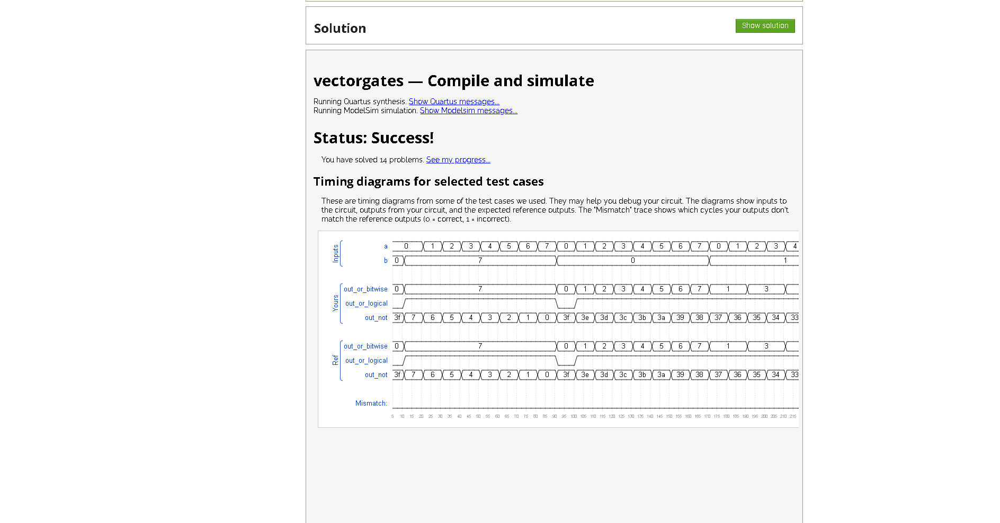
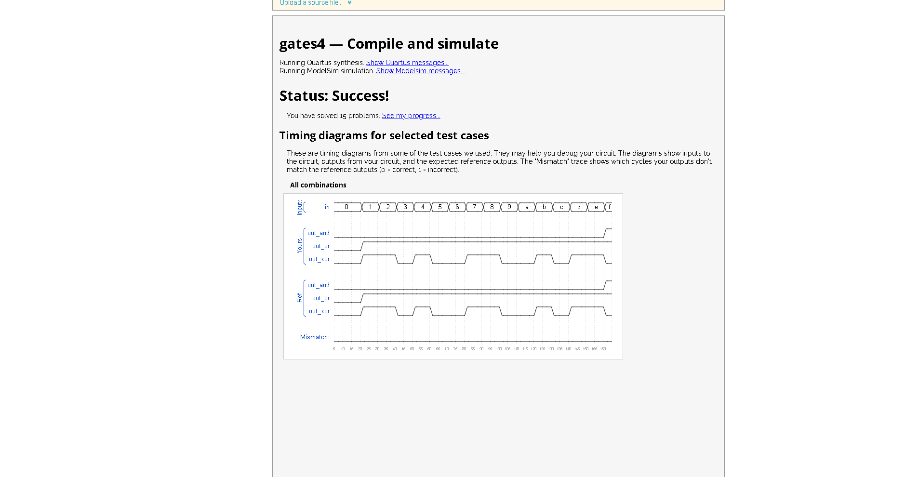
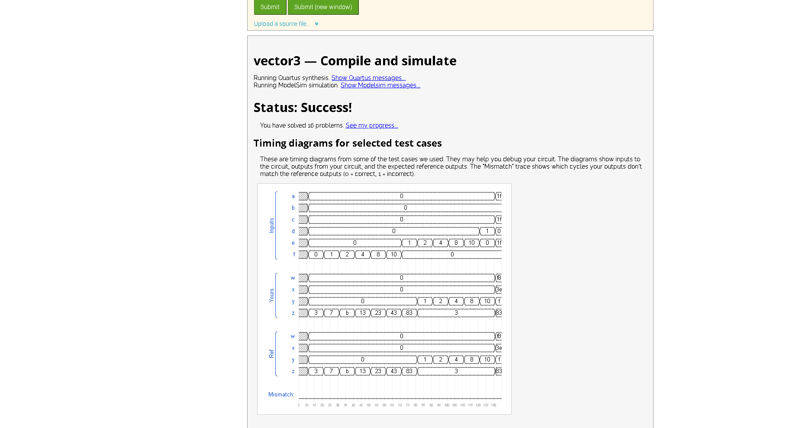
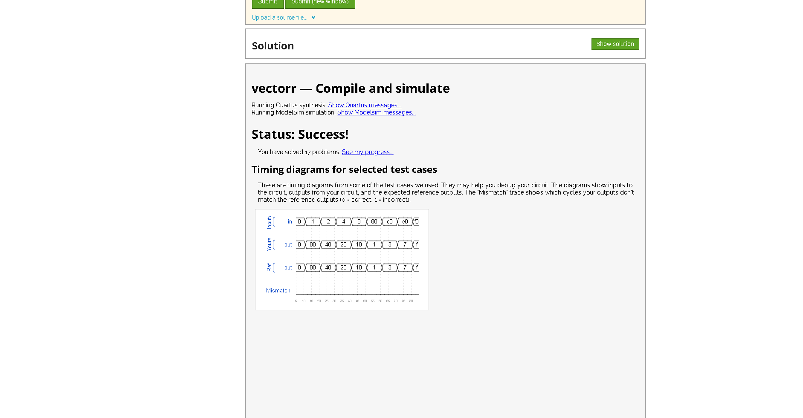
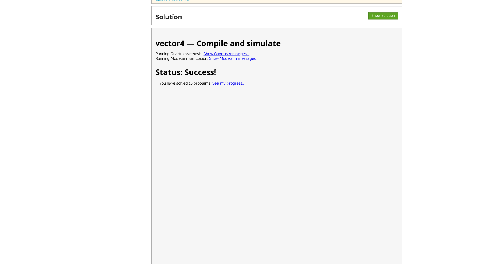
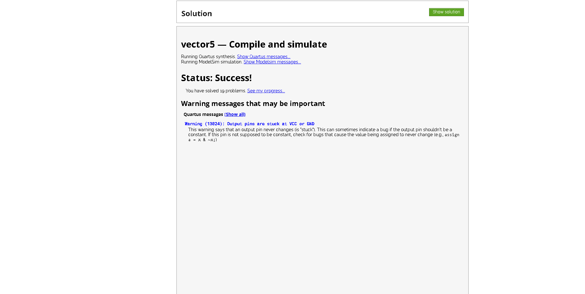

Vector0

Vector1

"C:\Users\sriba\OneDrive\Pictures\Screenshots\Screenshot 2024-09-02 220243.png"

Vector part select

Bitwise operators

Gates 4 i/p

Vector concatenation operation

Vector reversal

Replication operator

Vector 5

