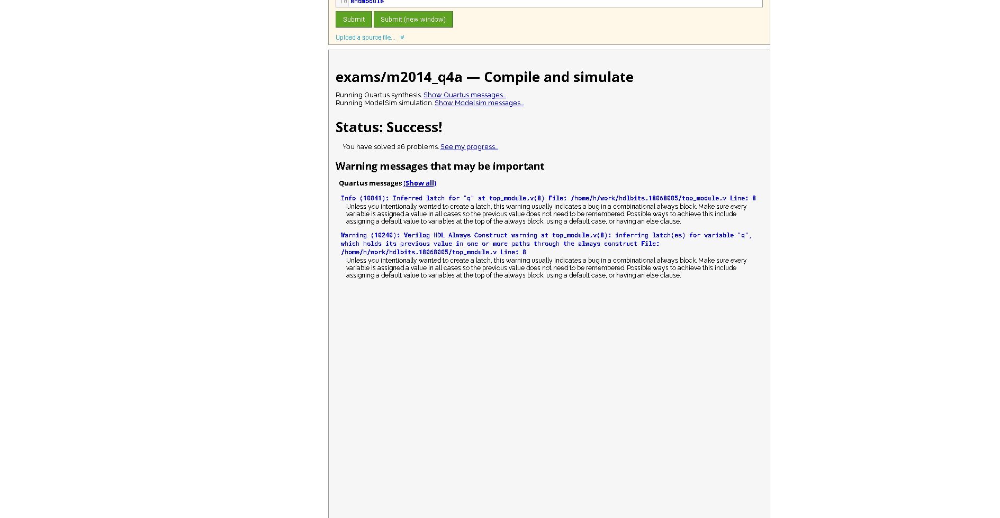
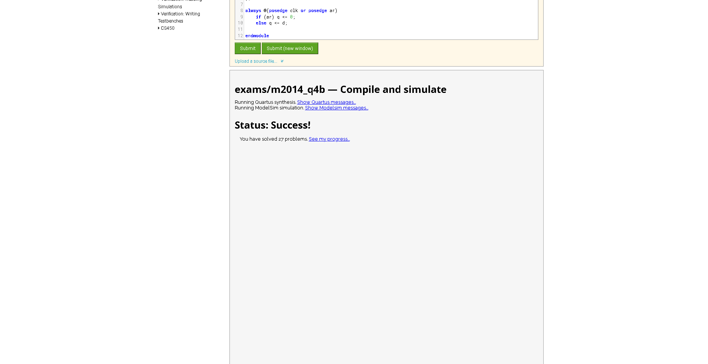
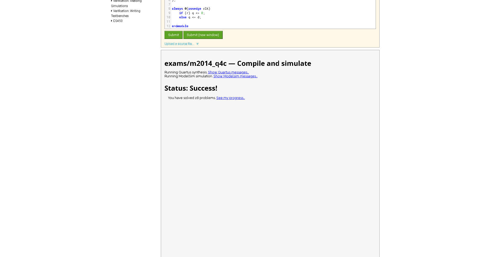
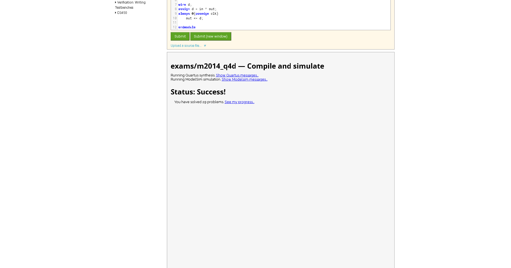
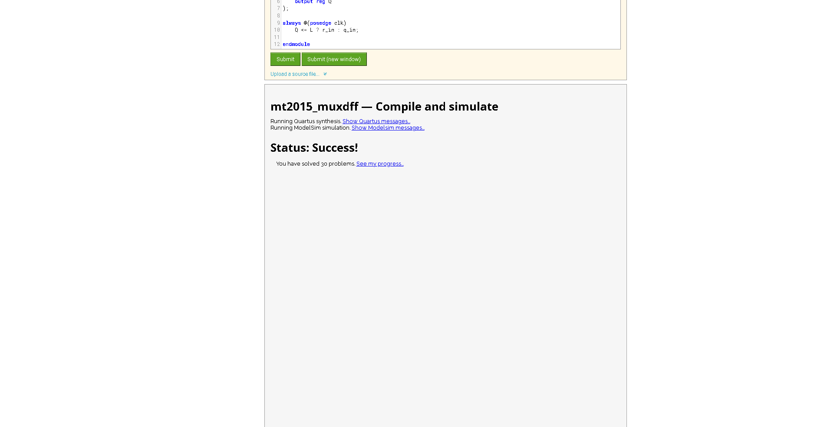
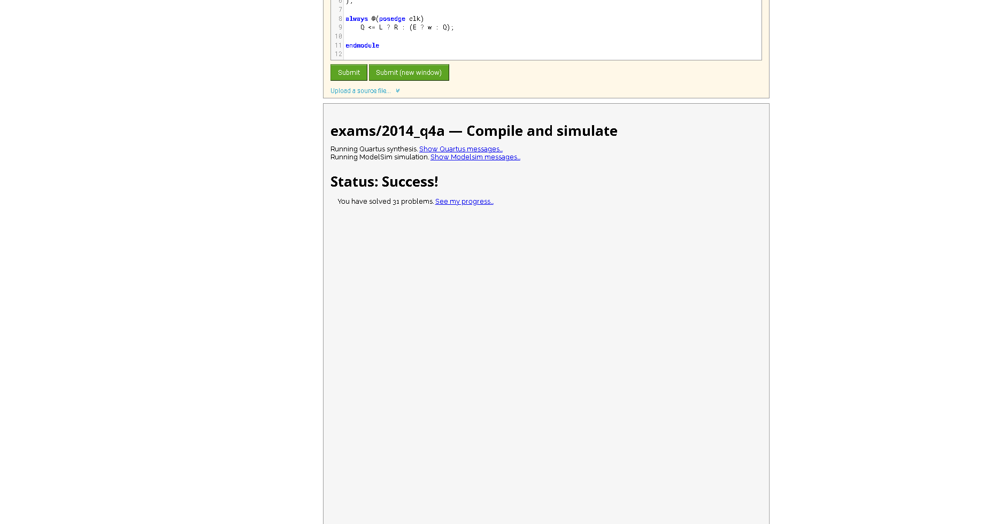
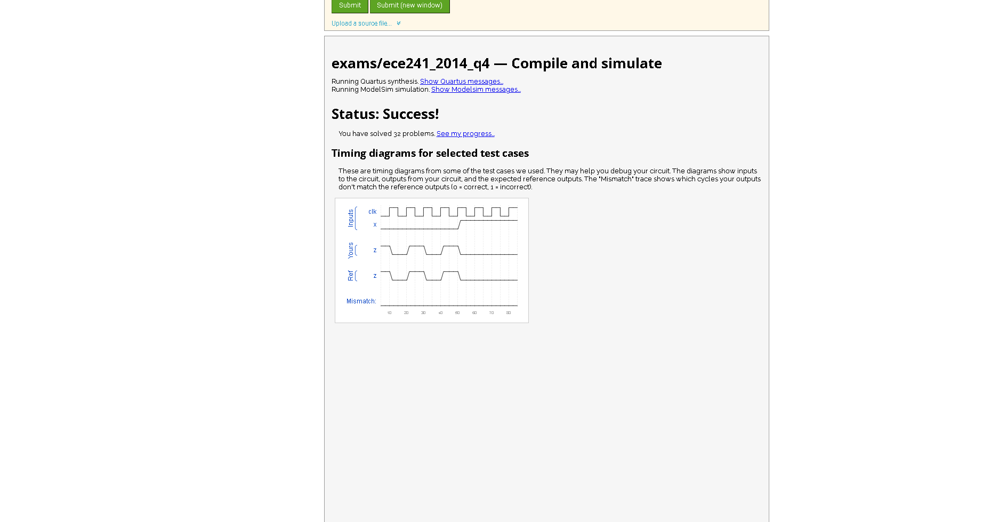
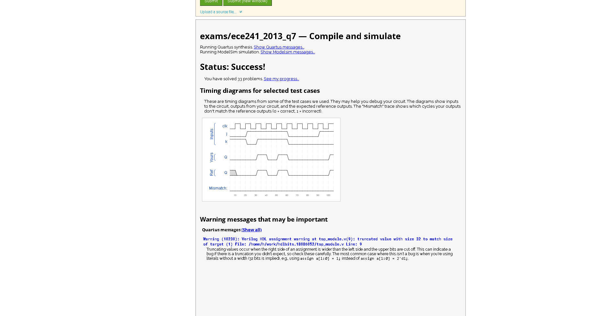

Dff 

Dffs

Dff with reset

Dff with reset value

Dff with asynchronus reset

Dff with byte enable

D latch

DFF

DFF 

DFF + Gate

Mux dff

Mux and dff

Dff and gates

create circuit from tt

detect edge

